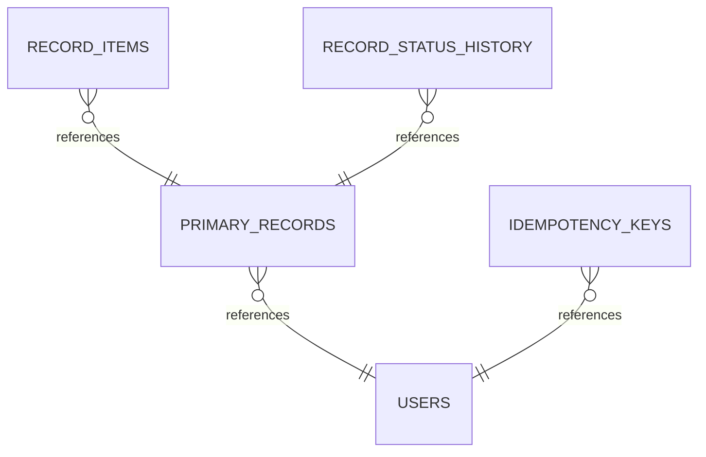
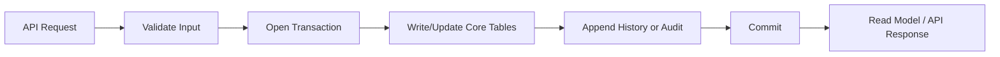
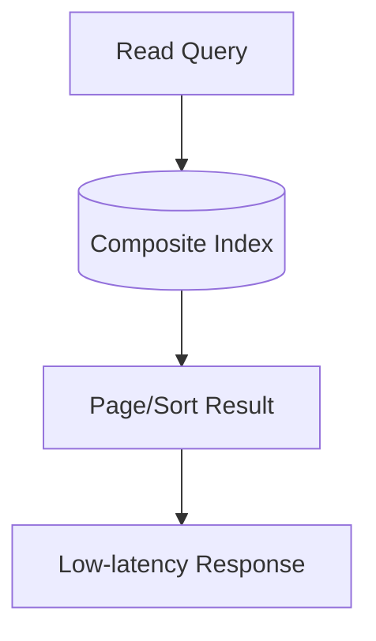

import CaseStudyPlayground from '@site/src/components/CaseStudyPlayground';

> Source: `car-rental-database-modelling/README.md`

# Car Rental Database Modelling

## Functional Requirement

- Create and update core domain records reliably.
- Fetch fast read APIs for dashboard, detail, and list views.
- Track lifecycle transitions (draft/active/completed/cancelled style states).
- Support retries safely without duplicate business effects.
- Enable operational visibility (audit, timeline, troubleshooting).

## Non-Functional Requirement

- **Correctness first:** constraints enforce key business invariants.
- **Performance:** p95 reads should stay low for hot paths using query-driven indexes.
- **Scalability:** support growth from early stage to high-scale partitioned workloads.
- **Availability:** isolate write failures and keep read APIs resilient.
- **Auditability:** retain history and actor/source metadata for compliance.

:::info Car Rental Database Modelling insight 1
Booking systems fail when availability checks and confirmation writes are not kept in one transactional boundary.
:::

:::info Car Rental Database Modelling insight 2
Your top index in this domain is usually user+time or resource+time to serve recent itineraries and availability lookup.
:::

## Thinking or strategy to approach this problem

1. Start with the top 5 API calls (2–3 writes, 2–3 reads).
2. Model source-of-truth tables around transaction boundaries.
3. Add append-only history for state transitions and replayability.
4. Add idempotency and audit trails before scale amplifies mistakes.
5. Add denormalized read models only where latency or cost justifies them.

:::note
Keep a clear hold/confirm/cancel event trail to diagnose overbooking and race conditions.
:::

## Core enttiles

- `users`
- `primary_records`
- `record_items`

## All tables and their relatoinship..

### `users`

- Purpose: stores **users** state.
- Key columns: `user_id`, `name`, `email`, `created_at`.
- Suggested write invariants: PK uniqueness, FK integrity, `NOT NULL` on required fields.

### `primary_records`

- Purpose: stores **primary records** state.
- Key columns: `record_id`, `user_id`, `status`, `total_cents`, `created_at`.
- Suggested write invariants: PK uniqueness, FK integrity, `NOT NULL` on required fields.

### `record_items`

- Purpose: stores **record items** state.
- Key columns: `item_id`, `record_id`, `item_name`, `quantity`, `amount_cents`.
- Suggested write invariants: PK uniqueness, FK integrity, `NOT NULL` on required fields.

### `record_status_history`

- Purpose: stores **record status history** state.
- Key columns: `record_id`, `sequence_no`, `from_status`, `to_status`, `changed_by`, `changed_at`.
- Suggested write invariants: PK uniqueness, FK integrity, `NOT NULL` on required fields.

### `idempotency_keys`

- Purpose: stores **idempotency keys** state.
- Key columns: `idempotency_key`, `user_id`, `request_hash`, `response_ref`, `created_at`, `expires_at`.
- Suggested write invariants: PK uniqueness, FK integrity, `NOT NULL` on required fields.

### `audit_logs`

- Purpose: stores **audit logs** state.
- Key columns: `audit_id`, `entity_type`, `entity_id`, `actor_id`, `action`, `source`, `created_at`.
- Suggested write invariants: PK uniqueness, FK integrity, `NOT NULL` on required fields.

### Relationship map

- `primary_records.user_id` -> `users.user_id`
- `record_items.record_id` -> `primary_records.record_id`
- `record_status_history.record_id` -> `primary_records.record_id`
- `idempotency_keys.user_id` -> `users.user_id`

## Visual understanding (auto-generated)

:::tip Try interactive playground for this case study
Open `/path/interactive-playground?case=car-rental-database-modelling` to experiment with indexes, retries, idempotency, and audit settings using a domain-tuned preset.
:::

These visuals are a quick mental model of the same schema and workflow described above. Start with ER (what is linked), then lifecycle (how writes happen safely), then query path (why reads are fast).

### ER relationship diagram

**How to read it:** arrows show FK direction from child to parent. Use this to validate ownership boundaries and cascade/constraint choices before writing migrations.

### Write lifecycle flow

**How to read it:** this is the safe write path. It highlights where to enforce validation, transactional consistency, and append-only history/audit so retries do not create data corruption.

### Query/index execution view

**How to read it:** read queries should hit a selective composite index first, then fetch a small sorted page. If this path scans full tables, refine index column order to match filter + sort patterns.

## Approach the solution and requirement fit

### Okaish option

- Keep only core tables and basic indexes.
- Works for MVP and low throughput.
- Gaps: weak audit trail, retry duplication risk, poor observability.

### Good option

- Add lifecycle history + idempotency key table.
- Add composite indexes for top list/detail reads.
- Add actor/source metadata for critical mutations.
- Satisfies most functional + reliability requirements for medium scale.

### Best option

- Keep immutable event/history trail plus canonical OLTP tables.
- Use outbox/eventing for async workflows and notification fanout.
- Build read-optimized projections/materialized views for heavy dashboards.
- Add partitioning (time/tenant/region) and archival policy.
- Add SLO-aware observability: slow-query logs, cardinality checks, index hit ratio.

:::note
Use **Best** only where workload justifies complexity. Over-engineering early can slow feature velocity.
:::

## Interactive solution sandbox

Start with **Okaish / Good / Best**, then tune technical percentages (with calculation help) and see table-level latency/risk visuals for your design decisions.

<CaseStudyPlayground caseSlug="car-rental-database-modelling" />

## Query execution, scale path, and performance depth

### Typical read paths

- **Timeline/list query:** filter + sort by recent timestamp (`created_at DESC`) with stable cursor pagination.
- **Detail query:** point lookup by PK + minimal joins to avoid N+1 patterns.
- **Operational query:** history/audit lookup for investigations.

### Recommended index strategy

- `idx_primary_records_user_created` on `primary_records(user_id, created_at DESC)`
- `idx_record_items_record` on `record_items(record_id)`
- `idx_primary_records_status_created` on `primary_records(status, created_at DESC)`
- `idx_status_history_record_time` on `record_status_history(record_id, changed_at DESC)`
- `idx_audit_entity_time` on `audit_logs(entity_type, entity_id, created_at DESC)`

### How queries run at different scales

- **< 100K rows/table:** straightforward B-Tree indexes usually enough.
- **100K–10M rows/table:** composite indexes + careful selectivity become critical.
- **10M+ rows/table:** partition by time/tenant/region; avoid cross-partition scans.
- **100M+ events/history:** separate hot vs cold storage, archive old partitions, and precompute heavy aggregates.

### Write path considerations

- Wrap related writes in a single transaction where invariants must hold.
- Keep transaction scope short to reduce lock contention.
- Use idempotency keys for retried API calls.
- For counters/aggregates, prefer async projection updates from outbox/event stream.

### Failure-mode design

- Duplicate requests -> blocked by idempotency constraint.
- Partial workflow failure -> recovered via event replay/history state.
- Slow read endpoints -> solved by index review or read model projection.
- Compliance/audit demand -> satisfied through immutable history + audit tables.

:::info Deep-dive tip
For each endpoint, document: `expected QPS`, `expected rows scanned`, `target p95`, and `index used`.
That one table is often enough to predict when a schema needs partitioning.
:::
