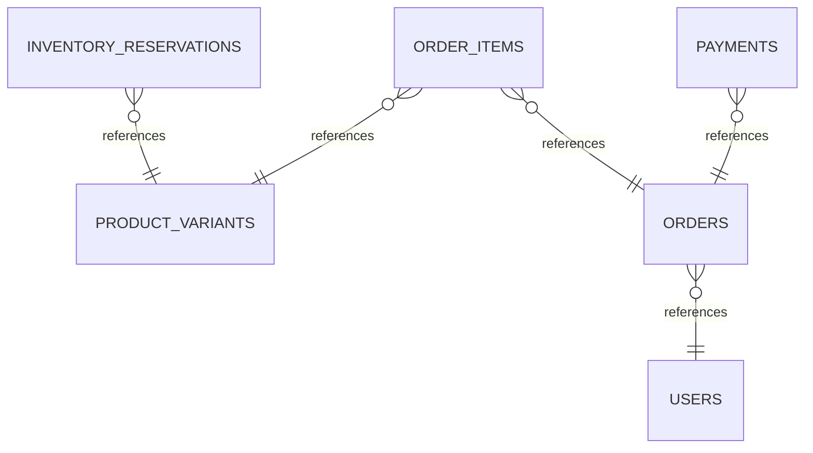
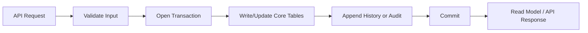
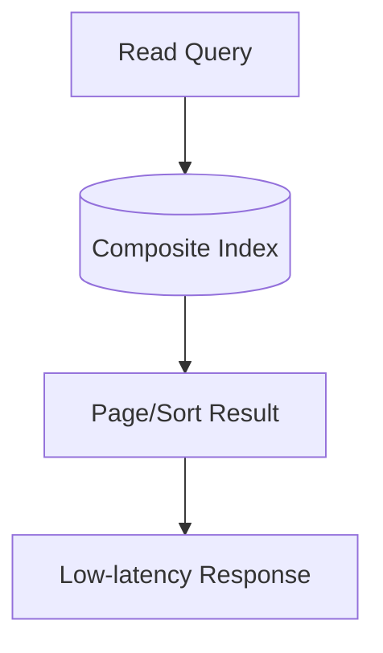

> Source: `ecommerce-order-inventory-payment/README.md`

# E-Commerce: Order + Inventory + Payment Database Modelling

## Functional Requirement

- Create and update core domain records reliably.
- Fetch fast read APIs for dashboard, detail, and list views.
- Track lifecycle transitions (draft/active/completed/cancelled style states).
- Support retries safely without duplicate business effects.
- Enable operational visibility (audit, timeline, troubleshooting).

## Non-Functional Requirement

- **Correctness first:** constraints enforce key business invariants.
- **Performance:** p95 reads should stay low for hot paths using query-driven indexes.
- **Scalability:** support growth from early stage to high-scale partitioned workloads.
- **Availability:** isolate write failures and keep read APIs resilient.
- **Auditability:** retain history and actor/source metadata for compliance.

:::info Fun fact 1
Most production incidents in CRUD-heavy systems are caused by **state transition ambiguity** (missing history), not by missing tables.
:::

:::info Fun fact 2
A single well-designed composite index can replace 3–5 naive indexes and significantly reduce write amplification.
:::

## Thinking or strategy to approach this problem

1. Start with the top 5 API calls (2–3 writes, 2–3 reads).
2. Model source-of-truth tables around transaction boundaries.
3. Add append-only history for state transitions and replayability.
4. Add idempotency and audit trails before scale amplifies mistakes.
5. Add denormalized read models only where latency or cost justifies them.

:::note
Think in **query shapes**, not entities alone. Entity-first modelling without query analysis almost always creates index debt.
:::

## Core enttiles

- `inventory_reservations`

## All tables and their relatoinship..

### `users`

- Purpose: stores **users** state.
- Key columns: `user_id`, `email`, `created_at`.
- Suggested write invariants: PK uniqueness, FK integrity, `NOT NULL` on required fields.

### `product_variants`

- Purpose: stores **product variants** state.
- Key columns: `variant_id`, `product_id`, `sku`, `price_cents`, `currency`, `is_active`, `created_at`.
- Suggested write invariants: PK uniqueness, FK integrity, `NOT NULL` on required fields.

### `inventory_reservations`

- Purpose: stores **inventory reservations** state.
- Key columns: `reservation_id`, `variant_id`, `order_id`, `quantity`, `status`, `--`, `created_at`.
- Suggested write invariants: PK uniqueness, FK integrity, `NOT NULL` on required fields.

### `orders`

- Purpose: stores **orders** state.
- Key columns: `order_id`, `user_id`, `status`, `--`, `tax_cents`, `shipping_cents`, `total_cents`, `created_at`.
- Suggested write invariants: PK uniqueness, FK integrity, `NOT NULL` on required fields.

### `order_items`

- Purpose: stores **order items** state.
- Key columns: `order_item_id`, `order_id`, `variant_id`, `quantity`, `unit_price_cents`.
- Suggested write invariants: PK uniqueness, FK integrity, `NOT NULL` on required fields.

### `payments`

- Purpose: stores **payments** state.
- Key columns: `payment_id`, `order_id`, `provider`, `provider_ref`, `amount_cents`, `currency`, `status`, `--`.
- Suggested write invariants: PK uniqueness, FK integrity, `NOT NULL` on required fields.

### Relationship map

- `inventory_reservations.variant_id` -> `product_variants.variant_id`
- `orders.user_id` -> `users.user_id`
- `order_items.order_id` -> `orders.order_id`
- `order_items.variant_id` -> `product_variants.variant_id`
- `payments.order_id` -> `orders.order_id`

## Visual understanding (auto-generated)

These visuals are a quick mental model of the same schema and workflow described above. Start with ER (what is linked), then lifecycle (how writes happen safely), then query path (why reads are fast).

### ER relationship diagram

**How to read it:** arrows show FK direction from child to parent. Use this to validate ownership boundaries and cascade/constraint choices before writing migrations.

### Write lifecycle flow

**How to read it:** this is the safe write path. It highlights where to enforce validation, transactional consistency, and append-only history/audit so retries do not create data corruption.

### Query/index execution view

**How to read it:** read queries should hit a selective composite index first, then fetch a small sorted page. If this path scans full tables, refine index column order to match filter + sort patterns.

## Approach the solution and requirement fit

### Okaish option

- Keep only core tables and basic indexes.
- Works for MVP and low throughput.
- Gaps: weak audit trail, retry duplication risk, poor observability.

### Good option

- Add lifecycle history + idempotency key table.
- Add composite indexes for top list/detail reads.
- Add actor/source metadata for critical mutations.
- Satisfies most functional + reliability requirements for medium scale.

### Best option

- Keep immutable event/history trail plus canonical OLTP tables.
- Use outbox/eventing for async workflows and notification fanout.
- Build read-optimized projections/materialized views for heavy dashboards.
- Add partitioning (time/tenant/region) and archival policy.
- Add SLO-aware observability: slow-query logs, cardinality checks, index hit ratio.

:::note
Use **Best** only where workload justifies complexity. Over-engineering early can slow feature velocity.
:::

## Query execution, scale path, and performance depth

### Typical read paths

- **Timeline/list query:** filter + sort by recent timestamp (`created_at DESC`) with stable cursor pagination.
- **Detail query:** point lookup by PK + minimal joins to avoid N+1 patterns.
- **Operational query:** history/audit lookup for investigations.

### Recommended index strategy

- `idx_orders_user_created` on `orders(user_id, created_at DESC)`
- `idx_order_items_order` on `order_items(order_id)`
- `idx_reservation_variant_status` on `inventory_reservations(variant_id, status)`
- `idx_payments_order_status` on `payments(order_id, status)`

### How queries run at different scales

- **< 100K rows/table:** straightforward B-Tree indexes usually enough.
- **100K–10M rows/table:** composite indexes + careful selectivity become critical.
- **10M+ rows/table:** partition by time/tenant/region; avoid cross-partition scans.
- **100M+ events/history:** separate hot vs cold storage, archive old partitions, and precompute heavy aggregates.

### Write path considerations

- Wrap related writes in a single transaction where invariants must hold.
- Keep transaction scope short to reduce lock contention.
- Use idempotency keys for retried API calls.
- For counters/aggregates, prefer async projection updates from outbox/event stream.

### Failure-mode design

- Duplicate requests -> blocked by idempotency constraint.
- Partial workflow failure -> recovered via event replay/history state.
- Slow read endpoints -> solved by index review or read model projection.
- Compliance/audit demand -> satisfied through immutable history + audit tables.

:::info Deep-dive tip
For each endpoint, document: `expected QPS`, `expected rows scanned`, `target p95`, and `index used`.
That one table is often enough to predict when a schema needs partitioning.
:::
