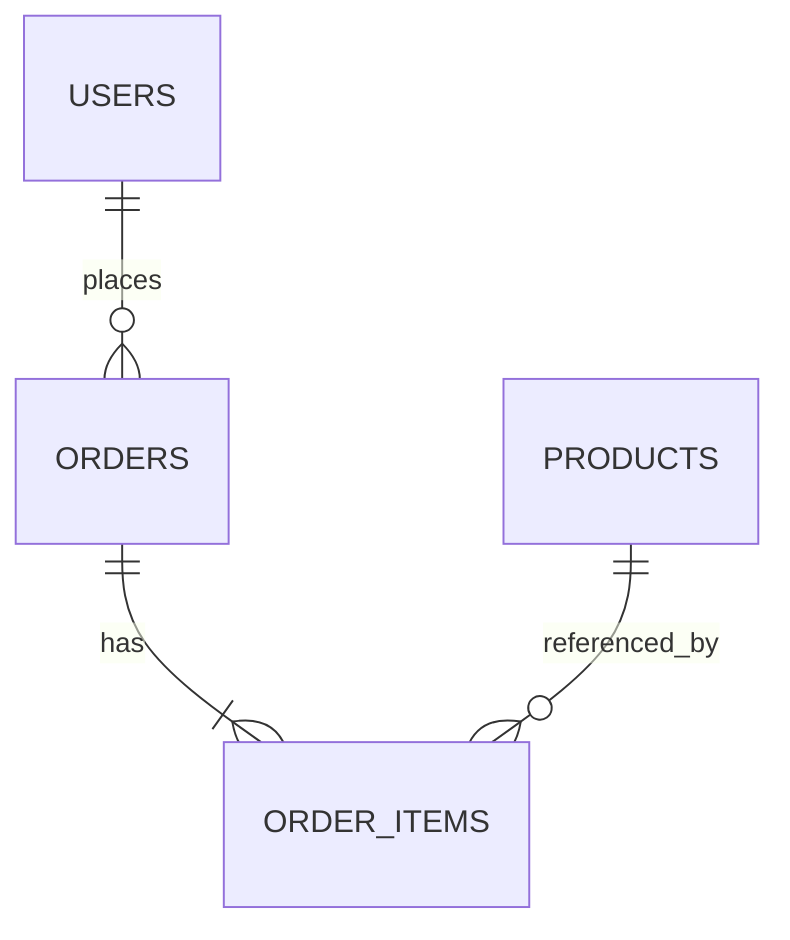
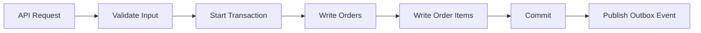
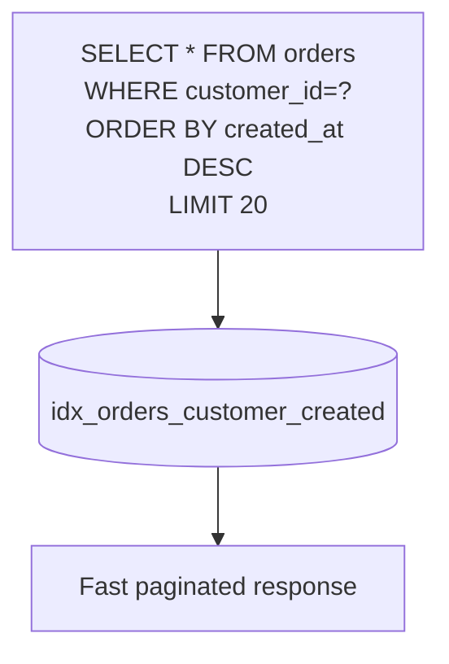

# Schema & query visuals

Yes — the site now supports **diagram plugins** for visualizing database tables and query flows.

## Mermaid support enabled

Use Mermaid blocks directly in docs pages:

## Query lifecycle flow

## Read path / index fit

## How to use in case studies

- Add a Mermaid block under each case study section:
  - ER diagram for entities
  - write flow for transaction boundaries
  - read flow for index strategy
- Keep diagrams small and task-oriented for better readability.
